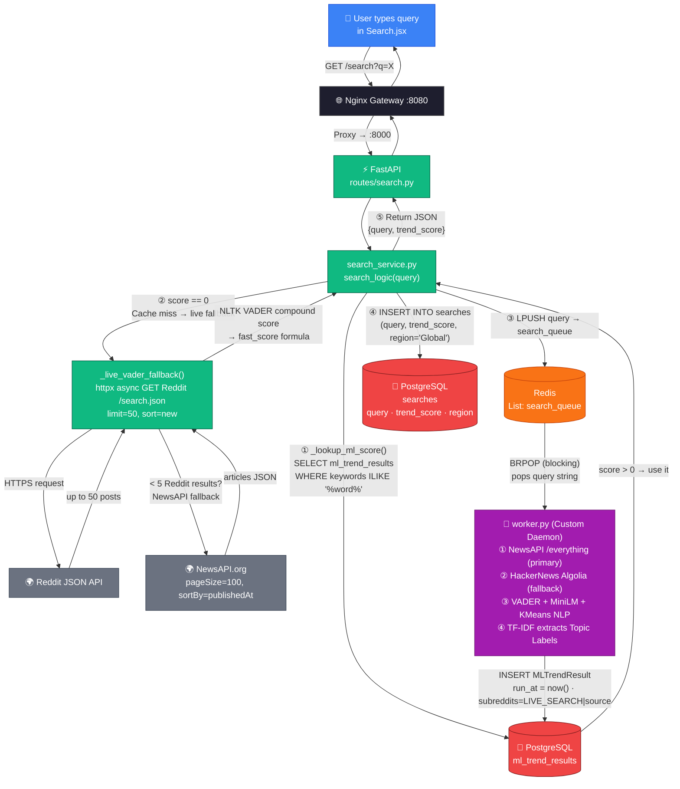
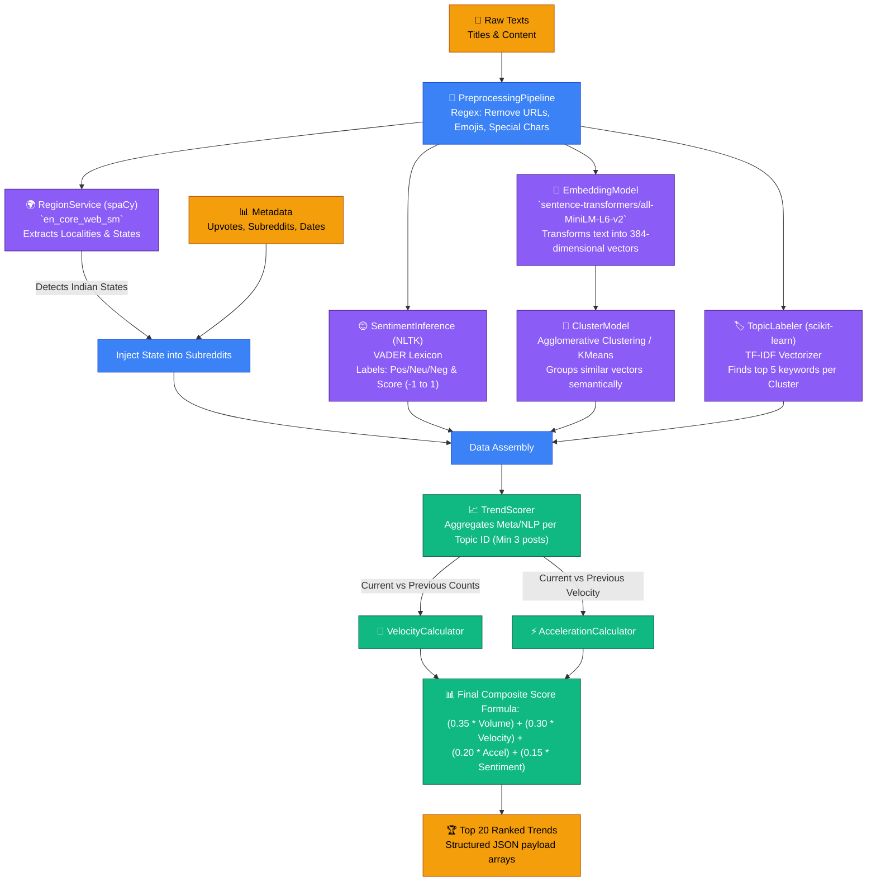

# Trend Intelligence System

  

Trend Intelligence System is a full-stack, distributed engine capable of dynamically measuring and predicting real-time global trends. By leveraging an event-driven architecture with high-speed caching and background Machine Learning workflows, the system calculates the Sentiment, Velocity, and Momentum of topics parsed from **three complementary sources**: Reddit (social sentiment), NewsAPI (authoritative fresh news), and HackerNews (tech community discourse).

---

## 🛠️ Complete Technology Stack & Architecture

We utilize an orchestrated blend of real-time caching, asynchronous workers, and heavy machine learning algorithms precisely tuned to isolate trends safely from social noise.

### 1. **Core Backend Layer**
  

- **FastAPI / Uvicorn:** Orchestrates the core ASGI REST APIs. Processes all incoming queries seamlessly via non-blocking asynchronous requests (`httpx`).
- **Nginx API Gateway:** Acts as the primary entrance node (`:8080`), seamlessly tunneling external traffic down to the internal FastAPI node while applying strictly enforced connection limits.
- **SQLAlchemy ORM:** Secures database insertions, managing bulk uploads from the data pipelines safely.

### 2. **Machine Learning & NLP**
  

- **sentence-transformers (`all-MiniLM-L6-v2`):** HuggingFace transformers mathematically translate plain sentences into massive 384-dimensional dense vectors to uncover underlying similarities beyond exact keyword matches.
- **scikit-learn (Agglomerative / KMeans):** Groups vectorized thoughts into clusters structurally, mathematically separating distinct world trends from each other.
- **scikit-learn (TF-IDF Vectorizer):** Responsible for labeling clustered posts into 5 human-readable keywords.
- **spaCy (`en_core_web_sm`):** Runs Named Entity Recognition (NER) to isolate locations/regions, dynamically feeding state-level tags into global posts for regional UI routing.
- **NLTK (VADER):** Computes precise positive, negative, and neutral fractional metrics from uncleaned web chatter.

### 3. **Infrastructure, Databases & Queues**
  

- **PostgreSQL:** Reliable structured warehouse containing `reddit_trends` (unified input from Reddit + NewsAPI + HackerNews) and `ml_trend_results` (fully computed topic structures).
- **Redis & Native Custom Worker:** Completely decodes request overhead safely, routing complex ML pipeline lookups to background workers (Windows compatible via `brpop`) while caching (TTL: 60s) instant fallback predictions.
- **Docker Compose:** Streamlines booting the Gateway, PostgreSQL, and Redis in unison.

### 4. **Modern Frontend**
 

- **React & Vite:** Ultra-fast hot-module reloading rendering fully modular architectures (`TrendCard`, `Graph`, etc.) with beautiful micro-animations for an impactful, native-app feel.

---

## 🖥️ How To Run This Project Locally

Follow these exact steps to run the complete environment (Databases, Redis, Nginx, ML queue, API, and Frontend).

### Prerequisites
- Docker Desktop
- Python 3.10+
- Node.js 18+ & npm

### Step 1: Environment Setup (.env)
Create a `.env` file at the root folder of the project:
```env
# PostgreSQL DB config
DB_USER=postgres
DB_PASSWORD=your_password
DB_HOST=127.0.0.1
DB_PORT=5433
DB_NAME=reddit_db

# NewsAPI (primary topic discovery source)
# Get a free key at https://newsapi.org/register
NEWS_API_KEY=your_newsapi_key_here
```
> No Reddit OAuth credentials are needed. Reddit is used with its public JSON API for sentiment signals only.

### Step 2: Boot Infrastructure
```bash
docker-compose up -d
```
*(Verify Postgres, Redis, and Nginx containers launch via `docker ps`)*

### Step 3: Set Up Python Virtual Environment
```bash
python -m venv venv
.\venv\Scripts\activate
pip install -r backend/requirements.txt
pip install -r req-dev.txt
python -m spacy download en_core_web_sm
```

### Step 4: Run Services (3 Terminals Needed)

**Terminal 2 (`cron_jobs.py` ETL):**
```bash
.\venv\Scripts\activate
python data_pipeline\schedulers\cron_jobs.py
```

**Terminal 3 (FastAPI Server):**
```bash
.\venv\Scripts\activate
uvicorn app.main:app --app-dir backend --reload --host 127.0.0.1 --port 8000
```

**Terminal 4 (Windows-Compatible Redis Worker):**
```bash
.\venv\Scripts\activate
python backend/worker.py
```

### Step 5: Start the React Frontend
**Terminal 5 (Vite):**
```bash
cd frontend
npm install
npm run dev
```

Visit `http://localhost:5173` to experience the system instantly.

---

## 🗺️ Visual Architecture & Flow Diagrams

### 1. High-Level Core Architecture

```mermaid
graph TD
%% ── Colour palette ──────────────────────────────────────────────────────────
classDef ui       fill:#3b82f6,stroke:#1d4ed8,color:#fff;
classDef gateway  fill:#1e1e2e,stroke:#444,color:#fff;
classDef backend  fill:#10b981,stroke:#065f46,color:#fff;
classDef service  fill:#059669,stroke:#064e3b,color:#fff;
classDef etl      fill:#f59e0b,stroke:#b45309,color:#000;
classDef ml       fill:#8b5cf6,stroke:#4c1d95,color:#fff;
classDef db       fill:#ef4444,stroke:#7f1d1d,color:#fff;
classDef cache    fill:#f97316,stroke:#c2410c,color:#fff;
classDef external fill:#6b7280,stroke:#374151,color:#fff;
classDef worker   fill:#a21caf,stroke:#701a75,color:#fff;

%% ══════════════════════════════════════════════════════════════════════════
%% LAYER 1 — FRONTEND (React + Vite)
%% ══════════════════════════════════════════════════════════════════════════
subgraph Frontend["🎨 Frontend  (React + Vite : localhost:5173)"]
    direction LR
    P_Search["📄 Search.jsx\n/search"]:::ui
    P_Global["📄 GlobalTrends.jsx\n/global-trends"]:::ui
    P_India["📄 IndiaTrends.jsx\n/india-trends"]:::ui
    C_SearchBar["🔍 SearchBar"]:::ui
    C_TrendCard["🃏 TrendCard"]:::ui
    C_Graph["📊 Graph (Recharts)"]:::ui
    C_NewsFeed["📰 NewsFeed"]:::ui
    C_Dropdown["📍 StateDropdown"]:::ui
end

%% ══════════════════════════════════════════════════════════════════════════
%% LAYER 2 — API GATEWAY (Nginx)
%% ══════════════════════════════════════════════════════════════════════════
Gateway["🌐 Nginx API Gateway\n(Docker : port 8080)\nProxies / → FastAPI :8000"]:::gateway

%% ══════════════════════════════════════════════════════════════════════════
%% LAYER 3 — BACKEND (FastAPI + Uvicorn)
%% ══════════════════════════════════════════════════════════════════════════
subgraph Backend["⚡ Backend  (FastAPI + Uvicorn : localhost:8000)"]
    direction TB
    Main["main.py\nApp entry-point & router mount"]:::backend

    subgraph Routes["Routes Layer"]
        R_Search["GET /search\n(routes/search.py)"]:::backend
        R_Trends["GET  /trends\n(routes/trends.py)"]:::backend
        R_Region["GET  /region\n(routes/region.py)"]:::backend
        R_News["GET  /news\n(routes/news.py)"]:::backend
        R_Health["GET  /health\n(routes/health.py)"]:::backend
    end

    subgraph Services["Services Layer"]
        S_Search["search_service.py\n① ML score lookup\n② Live VADER fallback\n③ Save Search to DB"]:::service
        S_Trend["trend_service.py\n① Query ml_trend_results\n② Rank by composite score"]:::service
        S_Region["region_service.py\n① State keyword map\n② Filter ml_trend_results\n   by subreddits column"]:::service
        S_News["nlp_summarizer.py\n① Fetch NewsAPI articles\n② VADER summary score"]:::service
    end
end

%% ══════════════════════════════════════════════════════════════════════════
%% LAYER 4 — BACKGROUND WORKER (Custom Redis Daemon)
%% ══════════════════════════════════════════════════════════════════════════
Worker["🤖 worker.py\nBlocking BRPOP on 'search_queue'\nRuns full ML TrendPipeline\nWrites result → PostgreSQL"]:::worker

%% ══════════════════════════════════════════════════════════════════════════
%% LAYER 5 — ETL DATA PIPELINE (Scheduled, hourly)
%% ══════════════════════════════════════════════════════════════════════════
subgraph ETL["🔄 Hybrid ETL Pipeline  (cron_jobs.py — runs hourly)"]
    direction TB
    subgraph Ph1["Phase 1 — Reddit Sentiment"]
        direction LR
        Collector["reddit_collector.py\n5 subreddits, hot+new\nExponential backoff\nDedup by post_id"]:::etl
        Cleaner["raw_to_clean.py\nRegex: strip URLs / emojis\nNormalise casing"]:::etl
        Loader["db_loader.py\nDataLoader.load_to_postgres()\nUpsert ON CONFLICT post_id"]:::etl
    end
    subgraph Ph2["Phase 2 — NewsAPI Topics"]
        NewsCol["news_collector.py\nHeadlines + topic search\nDirect to DB"]:::etl
    end
    subgraph Ph3["Phase 3 — HackerNews Tech"]
        HNCol["hacker_news_collector.py\nTop + new stories\nDirect to DB"]:::etl
    end
end
Collector --> Cleaner --> Loader

%% ══════════════════════════════════════════════════════════════════════════
%% LAYER 6 — ML ENGINE (Triggered after ETL)
%% ══════════════════════════════════════════════════════════════════════════
subgraph MLEngine["🧠 ML Engine  (TrendPipeline — called by ml_runner.py)"]
    direction TB
    ML_Runner["ml_runner.py\nOrchestrator — reads reddit_trends\nthen runs full pipeline"]:::ml
    Sentiment["sentiment/\nNLTK VADER\nCompound score −1 → +1\npos / neu / neg breakdown"]:::ml
    Embed["topic_modeling/\nsentence-transformers\nall-MiniLM-L6-v2\n384-d dense vectors"]:::ml
    Cluster["topic_modeling/\nscikit-learn KMeans\nSemantic grouping"]:::ml
    Topic["topic_modeling/\nTF-IDF Vectorizer\nTop-5 keywords per cluster"]:::ml
    Score["trend_detection/\nComposite score formula\n0.35·Vol + 0.30·Vel\n+0.20·Acc + 0.15·Sent"]:::ml
end
ML_Runner --> Sentiment --> Embed --> Cluster --> Topic --> Score

%% ══════════════════════════════════════════════════════════════════════════
%% LAYER 7 — STORAGE
%% ══════════════════════════════════════════════════════════════════════════
subgraph Storage["🗄️ Storage  (Docker-managed)"]
    PG_Raw[("PostgreSQL\nreddit_trends\npost_id · title · content\nups · subreddit · created_utc")]:::db
    PG_ML[("PostgreSQL\nml_trend_results\ntopic_id · keywords · score\nsentiment · velocity · subreddits")]:::db
    PG_Search[("PostgreSQL\nsearches\nquery · trend_score · region")]:::db
    Redis_Queue[("Redis :6379\nList: search_queue\n(LPUSH / BRPOP queue)")]:::cache
    Redis_Cache[("Redis :6379\nCache: search results\n(GET / SETEX)")]:::cache
end

%% ══════════════════════════════════════════════════════════════════════════
%% EXTERNAL APIs
%% ══════════════════════════════════════════════════════════════════════════
subgraph External["🌍 External APIs"]
    API_Reddit["Reddit JSON API\n(5 subreddits, sentiment only)\nhot+new, exponential backoff"]:::external
    API_News["NewsAPI.org\nPrimary topic discovery\n(free tier, NEWS_API_KEY)"]:::external
    API_HN["HackerNews API\n(Firebase + Algolia)\nNo auth, no rate limits"]:::external
end

%% ══════════════════════════════════════════════════════════════════════════
%% CONNECTIONS
%% ══════════════════════════════════════════════════════════════════════════

%% — Frontend → Gateway
P_Search  -->|"GET /search"| Gateway
P_Global  -->|"GET /trends"| Gateway
P_India   -->|"GET /region?state=X"| Gateway
P_India   -->|"GET /news?state=X"| Gateway

%% — Gateway → Backend
Gateway -->|"Proxy → :8000"| Main
Main --> R_Search & R_Trends & R_Region & R_News & R_Health

%% — Routes → Services
R_Search -->|"search_logic(query)"| S_Search
R_Trends -->|"get_trends(limit)"| S_Trend
R_Region -->|"get_region_trends(state)"| S_Region
R_News   -->|"fetch + summarise"| S_News

%% — Search Service dual path
S_Search -->|"① Lookup ML keywords"| PG_ML
S_Search -->|"② Cache miss → LPUSH query"| Redis_Queue
S_Search -->|"② Parallel live fallback\nhttpx → VADER score"| API_Reddit
S_Search -->|"② NewsAPI fallback\n(if Reddit < 5 results)"| API_News
S_Search -->|"③ Save Search record"| PG_Search
S_Search -->|"Cache hit → return"| Redis_Cache

%% — Trend & Region Services
S_Trend  -->|"MAX(run_at) + ORDER BY score"| PG_ML
S_Region -->|"Filter subreddits ILIKE state"| PG_ML

%% — News Service
S_News -->|"Fetch articles"| API_News

%% — Redis Queue → Worker
Redis_Queue -->|"BRPOP (blocking pop)"| Worker
Worker -->|"Extensive NLP & Clustering\nWrite MLTrendResult row"| PG_ML

%% — ETL Pipeline
Collector -->|"5 subreddits, hot+new"| API_Reddit
Loader    -->|"Upsert ON CONFLICT post_id"| PG_Raw
NewsCol   -->|"Headlines + topics"| API_News
NewsCol   -->|"Direct UPSERT"| PG_Raw
HNCol     -->|"Top + new stories"| API_HN
HNCol     -->|"Direct UPSERT"| PG_Raw

%% — ML Engine trigger
Loader    -->|"On ETL success\ntriggers ml_runner.py"| ML_Runner
ML_Runner -->|"Reads all sources combined"| PG_Raw
Score     -->|"Writes analysed clusters"| PG_ML
```


### 2. Live Data Flow Execution Diagram


### 3. ML Engine Internal Mathematical Pipeline

