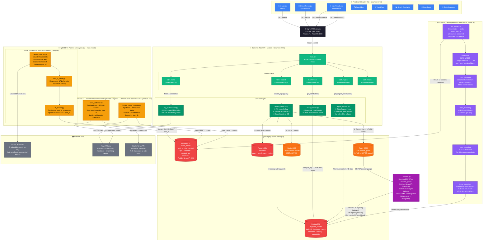

# Trend Intelligence System — Architecture Diagram

```mermaid
graph TD

%% ── Colour palette ──────────────────────────────────────────────────────────
classDef ui       fill:#3b82f6,stroke:#1d4ed8,color:#fff;
classDef gateway  fill:#1e1e2e,stroke:#444,color:#fff;
classDef backend  fill:#10b981,stroke:#065f46,color:#fff;
classDef service  fill:#059669,stroke:#064e3b,color:#fff;
classDef etl      fill:#f59e0b,stroke:#b45309,color:#000;
classDef ml       fill:#8b5cf6,stroke:#4c1d95,color:#fff;
classDef db       fill:#ef4444,stroke:#7f1d1d,color:#fff;
classDef cache    fill:#f97316,stroke:#c2410c,color:#fff;
classDef external fill:#6b7280,stroke:#374151,color:#fff;
classDef worker   fill:#a21caf,stroke:#701a75,color:#fff;

%% ══════════════════════════════════════════════════════════════════════════
%% LAYER 1 — FRONTEND (React + Vite)
%% ══════════════════════════════════════════════════════════════════════════
subgraph Frontend["🎨 Frontend  (React + Vite : localhost:5173)"]
    direction LR
    P_Search["📄 Search.jsx\n/search"]:::ui
    P_Global["📄 GlobalTrends.jsx\n/global-trends"]:::ui
    P_India["📄 IndiaTrends.jsx\n/india-trends"]:::ui
    C_SearchBar["🔍 SearchBar"]:::ui
    C_TrendCard["🃏 TrendCard"]:::ui
    C_Graph["📊 Graph (Recharts)"]:::ui
    C_NewsFeed["📰 NewsFeed"]:::ui
    C_Dropdown["📍 StateDropdown"]:::ui
end

%% ══════════════════════════════════════════════════════════════════════════
%% LAYER 2 — API GATEWAY (Nginx)
%% ══════════════════════════════════════════════════════════════════════════
Gateway["🌐 Nginx API Gateway\n(Docker : port 8080)\nProxies / → FastAPI :8000"]:::gateway

%% ══════════════════════════════════════════════════════════════════════════
%% LAYER 3 — BACKEND (FastAPI + Uvicorn)
%% ══════════════════════════════════════════════════════════════════════════
subgraph Backend["⚡ Backend  (FastAPI + Uvicorn : localhost:8000)"]
    direction TB
    Main["main.py\nApp entry-point & router mount"]:::backend

    subgraph Routes["Routes Layer"]
        R_Search["POST /search\n(routes/search.py)"]:::backend
        R_Trends["GET  /trends\n(routes/trends.py)"]:::backend
        R_Region["GET  /region\n(routes/region.py)"]:::backend
        R_News["GET  /news\n(routes/news.py)"]:::backend
        R_Health["GET  /health\n(routes/health.py)"]:::backend
    end

    subgraph Services["Services Layer"]
        S_Search["search_service.py\n① ML score lookup\n② Live VADER fallback\n③ Save Search to DB"]:::service
        S_Trend["trend_service.py\n① Query ml_trend_results\n② Rank by composite score"]:::service
        S_Region["region_service.py\n① State keyword map\n② Filter ml_trend_results\n   by subreddits column"]:::service
        S_News["nlp_summarizer.py\n① Fetch NewsAPI articles\n② VADER summary score"]:::service
    end
end

%% ══════════════════════════════════════════════════════════════════════════
%% LAYER 4 — BACKGROUND WORKER (Custom Redis Daemon)
%% ══════════════════════════════════════════════════════════════════════════
Worker["🤖 worker.py\nBlocking BRPOP on 'search_queue'\nFetches NewsAPI /everything\nHackerNews Algolia fallback\nRuns full ML TrendPipeline\nWrites result → PostgreSQL"]:::worker

%% ══════════════════════════════════════════════════════════════════════════
%% LAYER 5 — HYBRID ETL DATA PIPELINE (Scheduled, hourly)
%% ══════════════════════════════════════════════════════════════════════════
subgraph ETL["🔄 Hybrid ETL Pipeline  (cron_jobs.py — runs hourly)"]
    direction TB

    subgraph Phase1["Phase 1 — Reddit Sentiment Signals (CSV path)"]
        direction LR
        Reddit["reddit_collector.py\n5 curated subreddits\nhot+new dual feed\nExponential backoff\nDedup by post_id"]:::etl
        Cleaner["raw_to_clean.py\nRegex: strip URLs / emojis\nNormalise casing"]:::etl
        Loader["db_loader.py\nDataLoader.load_to_postgres()\nUpsert ON CONFLICT post_id"]:::etl
    end

    subgraph Phase2["Phase 2 — NewsAPI Topic Discovery (direct to DB)"]
        News["news_collector.py\nTop headlines + 10 topic searches\nUser search queries from DB\nSortBy=publishedAt (freshest)"]:::etl
    end

    subgraph Phase3["Phase 3 — HackerNews Tech Discourse (direct to DB)"]
        HN["hacker_news_collector.py\ntopstories + newstories feeds\nNo auth / no rate limits\nDedup by story ID"]:::etl
    end
end
Reddit --> Cleaner --> Loader

%% ══════════════════════════════════════════════════════════════════════════
%% LAYER 6 — ML ENGINE (Triggered after all ETL phases)
%% ══════════════════════════════════════════════════════════════════════════
subgraph MLEngine["🧠 ML Engine  (TrendPipeline — called by ml_runner.py)"]
    direction TB
    ML_Runner["ml_runner.py\nOrchestrator — reads reddit_trends\n(all sources combined)\nthen runs full pipeline"]:::ml
    Sentiment["sentiment/\nNLTK VADER\nCompound score −1 → +1\npos / neu / neg breakdown"]:::ml
    Embed["topic_modeling/\nsentence-transformers\nall-MiniLM-L6-v2\n384-d dense vectors"]:::ml
    Cluster["topic_modeling/\nscikit-learn KMeans\nSemantic grouping"]:::ml
    Topic["topic_modeling/\nTF-IDF Vectorizer\nTop-5 keywords per cluster"]:::ml
    Score["trend_detection/\nComposite score formula\n0.35·Vol + 0.30·Vel\n+0.20·Acc + 0.15·Sent"]:::ml
end
ML_Runner --> Sentiment --> Embed --> Cluster --> Topic --> Score

%% ══════════════════════════════════════════════════════════════════════════
%% LAYER 7 — STORAGE
%% ══════════════════════════════════════════════════════════════════════════
subgraph Storage["🗄️ Storage  (Docker-managed)"]
    PG_Raw[("PostgreSQL\nreddit_trends\npost_id · title · content\nups · subreddit · created_utc\nSources: Reddit+NewsAPI+HN")]:::db
    PG_ML[("PostgreSQL\nml_trend_results\ntopic_id · keywords · score\nsentiment · velocity · subreddits")]:::db
    PG_Search[("PostgreSQL\nsearches\nquery · trend_score · region")]:::db
    Redis_Queue[("Redis :6379\nList: search_queue\n(LPUSH / BRPOP queue)")]:::cache
    Redis_Cache[("Redis :6379\nCache: search results\n(GET / SETEX)")]:::cache
end

%% ══════════════════════════════════════════════════════════════════════════
%% EXTERNAL APIs
%% ══════════════════════════════════════════════════════════════════════════
subgraph External["🌍 External APIs"]
    API_Reddit["Reddit JSON API\n(5 subreddits, sentiment only)\nhot+new feeds, exponential backoff"]:::external
    API_News["NewsAPI.org\nPrimary topic discovery\nheadlines + /everything search"]:::external
    API_HN["HackerNews API\n(Firebase + Algolia)\nTech discourse, no rate limits"]:::external
end

%% ══════════════════════════════════════════════════════════════════════════
%% CONNECTIONS
%% ══════════════════════════════════════════════════════════════════════════

%% — Frontend → Gateway
P_Search  -->|"GET /search"| Gateway
P_Global  -->|"GET /trends"| Gateway
P_India   -->|"GET /region?state=X"| Gateway
P_India   -->|"GET /news?state=X"| Gateway

%% — Gateway → Backend
Gateway -->|"Proxy → :8000"| Main
Main --> R_Search & R_Trends & R_Region & R_News & R_Health

%% — Routes → Services
R_Search -->|"search_logic(query)"| S_Search
R_Trends -->|"get_trends(limit)"| S_Trend
R_Region -->|"get_region_trends(state)"| S_Region
R_News   -->|"fetch + summarise"| S_News

%% — Search Service dual path
S_Search -->|"① Lookup ML keywords"| PG_ML
S_Search -->|"② Cache miss → LPUSH query"| Redis_Queue
S_Search -->|"③ Save Search record"| PG_Search
S_Search -->|"Cache hit → return"| Redis_Cache

%% — Trend & Region Services
S_Trend  -->|"MAX(run_at) + ORDER BY score"| PG_ML
S_Region -->|"Filter subreddits ILIKE state"| PG_ML

%% — News Service
S_News -->|"Fetch articles"| API_News

%% — Redis Queue → Worker
Redis_Queue -->|"BRPOP (blocking pop)"| Worker
Worker -->|"NewsAPI /everything (primary)\nHN Algolia (fallback)\nML → write MLTrendResult"| PG_ML

%% — Phase 1: Reddit (CSV pipeline)
Reddit    -->|"5 subreddits, hot+new"| API_Reddit
Loader    -->|"Upsert ON CONFLICT post_id"| PG_Raw

%% — Phase 2: NewsAPI (direct to DB)
News      -->|"Top headlines + topics"| API_News
News      -->|"DataLoader → Upsert"| PG_Raw

%% — Phase 3: HackerNews (direct to DB)
HN        -->|"topstories + newstories"| API_HN
HN        -->|"DataLoader → Upsert"| PG_Raw

%% — ML Engine trigger
ML_Runner -->|"Reads all sources combined"| PG_Raw
Score     -->|"Writes analysed clusters"| PG_ML
```
