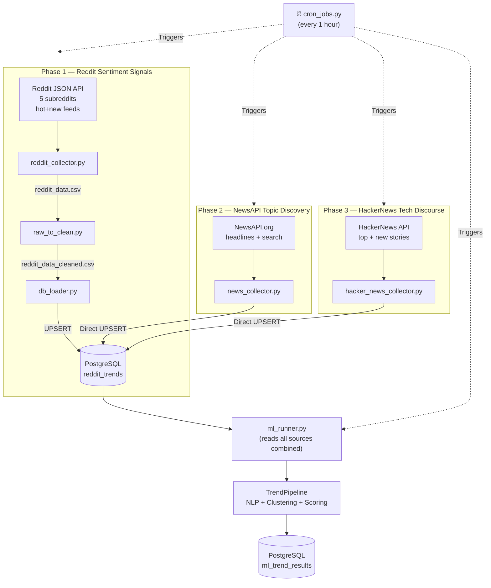

# Data Pipeline Documentation

This module manages the core Extract, Transform, Load (ETL) pipeline for the Trend Intelligence project. It is designed to run continuously in the background to automatically amass and harmonize data points for downstream machine-learning tasks.

> **Architecture Update (April 2026):** The pipeline now uses a **Hybrid 3-Source** strategy. Reddit is retained as a lightweight **sentiment signal source** (5 subreddits), while **NewsAPI** and **HackerNews** serve as the primary **topic discovery sources**. This eliminates the Reddit 429 rate-limiting problem that caused stale trends.

---

## 🌊 How the Data Flows

---

## 📂 Module Breakdown & Functions

### 1. `config.py`
The global configuration file for all pipeline constants.

- **Subreddits:** Reduced to 5 high-signal, sentiment-rich communities: `worldnews`, `technology`, `AskReddit`, `science`, `economy`
- **POST_LIMIT:** 20 posts per subreddit per sort mode (hot + new = up to 40, deduped)
- **REDDIT_SORT_MODES:** `["new", "hot"]` — dual feed for recency and engagement balance
- **Keywords:** Empty — topic discovery now handled by NewsAPI
- **NewsAPI Key:** Read from `NEWS_API_KEY` in `.env`

---

### 2. `collectors/`
Responsible for the **Extract** phase. Three collectors, all writing to the same `reddit_trends` table.

#### `reddit_collector.py` — Sentiment Signal Source
- Fetches posts from **5 curated subreddits** (down from 25)
- Dual feed per subreddit: `/hot.json` (engagement) + `/new.json` (recency)
- **Deduplicates** by `post_id` — overlapping posts between feeds removed
- **Exponential backoff** on 429 rate-limit errors: waits 15s → 30s → 60s (3 retries before skip)
- **Adaptive inter-source delay**: increases progressively if 429s occur this session
- Fetches comments for **top 10 posts only** (by score) to conserve API quota
- Saves to `reddit_data.csv` → cleaned by `raw_to_clean.py` → loaded by `db_loader.py`

#### `news_collector.py` — Primary Topic Discovery Source ⭐
- Fetches **top headlines** (60 articles, all categories)
- Fetches topic-specific articles for 10 default categories (AI, economy, science, etc.)
- Fetches articles for recent **user search queries** from the `searches` DB table
- Stable `post_id` derived from URL hash (prevents re-ingestion of same articles)
- `sortBy=publishedAt` — always returns the **freshest** articles
- Writes **directly to PostgreSQL** via `DataLoader` (no CSV step)

#### `hacker_news_collector.py` — Tech Discourse Source ⭐
- Fetches from **both** `topstories` and `newstories` Firebase API feeds
- Deduplicates by story ID across both feeds
- Filters out `deleted` and `dead` posts
- **No authentication required · No rate limits**
- Writes **directly to PostgreSQL** via `DataLoader` (no CSV step)

---

### 3. `processors/`
Responsible for the **Transform** phase (Reddit CSV path only).

#### `raw_to_clean.py`
- Reads `reddit_data.csv` and applies regex cleaning to title, text, and comments
- Strips URLs, emojis, special characters; normalises whitespace and casing
- Outputs `reddit_data_cleaned.csv`
- *NewsAPI and HackerNews collectors skip this step — their data is already structured*

---

### 4. `loaders/`
Responsible for the **Load** phase.

#### `db_loader.py`
- Exposes `DataLoader.load_to_postgres()` used by all three collectors
- Performs **UPSERT** on `post_id` → prevents duplicates across pipeline runs
- On conflict: updates `ups`, `num_comments`, `content`, and `processed_at`
- Reddit CSV path: called by `cron_jobs.py` after cleaning
- NewsAPI/HN paths: called directly from within each collector

---

### 5. `schedulers/`
Responsible for orchestrating the full pipeline.

#### `cron_jobs.py`
- Runs the **4-phase pipeline** every 1 hour (configurable)
- Runs once immediately on startup (no waiting for the first hour)
- **Phase 1:** Reddit → clean → load (CSV path)
- **Phase 2:** NewsAPI → load (direct)
- **Phase 3:** HackerNews → load (direct)
- **Phase 4:** ML Engine analysis on all combined data
- Phases 2, 3, and 4 always run regardless of Reddit success/failure

---

## 🗄️ Data Storage Locations

| Path | Contents | Created by |
|------|----------|------------|
| `collectors/reddit_data.csv` | Raw Reddit posts (this run) | `reddit_collector.py` |
| `collectors/reddit_data_cleaned.csv` | Cleaned Reddit posts | `raw_to_clean.py` |
| `PostgreSQL: reddit_trends` | All posts (Reddit + NewsAPI + HN), 24h TTL | All three collectors via `db_loader.py` |
| `PostgreSQL: ml_trend_results` | ML trend clusters, 24h TTL | `ml_runner.py` |

---

## ⚠️ Why Reddit Is Not the Primary Source

Reddit's unauthenticated JSON API is rate-limited to approximately **10 requests/minute**. With 25+ subreddits, each requiring multiple requests, the old pipeline generated hundreds of 429 errors per run — causing most subreddits to be skipped and the ML engine to receive sparse, unrepresentative data.

The new hybrid strategy:
1. **Keeps Reddit** for what it does uniquely well: informal social sentiment from 5 high-quality communities
2. **Adds NewsAPI** as the authoritative, fresh topic source (free tier: 100 articles/request)
3. **Adds HackerNews** for tech community discourse with zero rate-limiting risk
