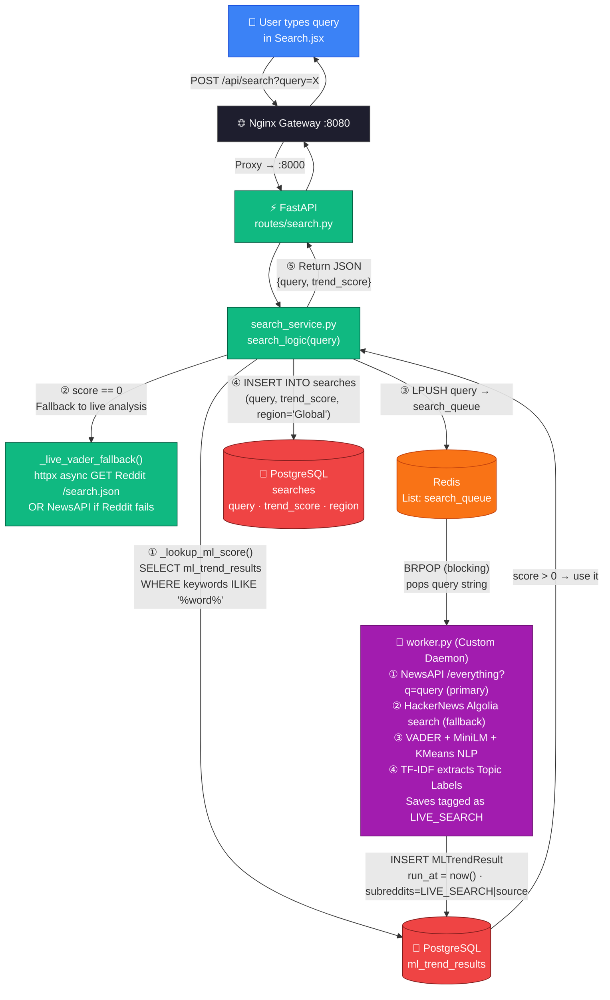
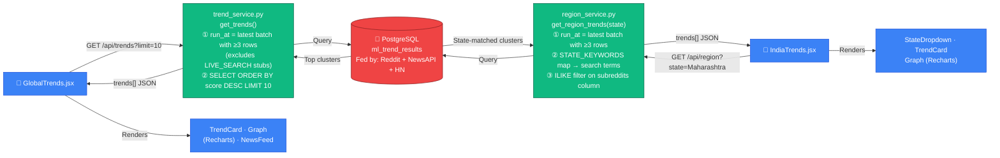

# Trend Intelligence System — Data Flow Diagram

> Traces every data transformation from ingestion to the user's browser. Verified against source code.

---

## Path A — Hourly Batch Pipeline (Time-Triggered, Hybrid 3-Source)

```mermaid
flowchart TD

%% ── Styles ──────────────────────────────────────────────────────────────────
classDef trigger  fill:#1e1e2e,stroke:#555,color:#fff;
classDef collect  fill:#f59e0b,stroke:#b45309,color:#000;
classDef process  fill:#3b82f6,stroke:#1d4ed8,color:#fff;
classDef store    fill:#ef4444,stroke:#7f1d1d,color:#fff;
classDef ml       fill:#8b5cf6,stroke:#4c1d95,color:#fff;
classDef output   fill:#10b981,stroke:#065f46,color:#fff;
classDef file     fill:#334155,stroke:#475569,color:#fff;
classDef ext      fill:#6b7280,stroke:#374151,color:#fff;

%% ── TRIGGER ─────────────────────────────────────────────────────────────────
CRON["⏰ cron_jobs.py\nPython schedule — fires every 1 hour\nRuns once immediately on startup\n4-phase sequential pipeline"]:::trigger

%% ══════════════════════════════════════════════════════════════════════════
%% PHASE 1 — Reddit Sentiment Signals (CSV pipeline)
%% ══════════════════════════════════════════════════════════════════════════
CRON -->|"Phase 1"| COL

COL["📡 reddit_collector.py\n① 5 curated subreddits (sentiment-focused)\n② Dual feed: /hot.json + /new.json per subreddit\n③ Exponential backoff on 429 (3 retries: 15s/30s/60s)\n④ Adaptive inter-source delay (increases on 429 hits)\n⑤ Dedup by post_id (hot+new overlap removed)\n⑥ Fetches comments for top-10 posts only"]:::collect

COL -->|"5 subreddits, hot+new"| REDDIT_API["🌍 Reddit JSON API\n(unauthenticated, 5 subreddits only)"]:::ext
REDDIT_API -->|"JSON response (with backoff)"| COL
COL -->|"pd.DataFrame.to_csv()"| RAW_CSV["📄 collectors/reddit_data.csv\nColumns: post_id · title · text ·\nscore · comments · subreddit · datetime_utc"]:::file

CRON -->|"Phase 1 (if Reddit ok)"| CLEAN
RAW_CSV -->|"pd.read_csv()"| CLEAN
CLEAN["🧹 raw_to_clean.py\n① Strip URLs (regex)\n② Remove emojis, special chars\n③ Normalise whitespace & casing"]:::process
CLEAN -->|"pd.DataFrame.to_csv()"| CLEAN_CSV["📄 collectors/reddit_data_cleaned.csv"]:::file

CRON -->|"Phase 1 (if clean ok)"| LOADER
CLEAN_CSV -->|"pd.read_csv()"| LOADER
LOADER["📥 db_loader.py  ·  DataLoader.load_to_postgres()\n① Intra-batch dedup on post_id\n② Rename cols → schema names\n③ UPSERT: ON CONFLICT (post_id) DO UPDATE"]:::process
LOADER -->|"SQLAlchemy · UPSERT"| PG_RAW

%% ══════════════════════════════════════════════════════════════════════════
%% PHASE 2 — NewsAPI Topic Discovery (direct to DB)
%% ══════════════════════════════════════════════════════════════════════════
CRON -->|"Phase 2"| NEWS_COL

NEWS_COL["📰 news_collector.py\n① Top headlines (60 articles, fresh)\n② Topic searches: 10 default categories\n③ User search terms from searches table\n④ Stable post_id from URL hash\n⑤ SortBy=publishedAt (always freshest)\n⑥ Dedup by post_id"]:::collect

NEWS_COL -->|"GET /top-headlines + /everything"| NEWS_API["🌍 NewsAPI.org\n(free tier, NEWS_API_KEY)"]:::ext
NEWS_API -->|"articles JSON"| NEWS_COL
NEWS_COL -->|"DataLoader.load_to_postgres()\nDirect → no CSV step"| PG_RAW

%% ══════════════════════════════════════════════════════════════════════════
%% PHASE 3 — HackerNews Tech Discourse (direct to DB)
%% ══════════════════════════════════════════════════════════════════════════
CRON -->|"Phase 3"| HN_COL

HN_COL["🔥 hacker_news_collector.py\n① topstories feed (top 60)\n② newstories feed (top 30)\n③ Dedup by story ID\n④ Filters dead/deleted posts\n⑤ No auth · No rate limits"]:::collect

HN_COL -->|"Firebase API + item fetches"| HN_API["🌍 HackerNews Firebase API\n(free, no auth, no rate limits)"]:::ext
HN_API -->|"story JSON"| HN_COL
HN_COL -->|"DataLoader.load_to_postgres()\nDirect → no CSV step"| PG_RAW

%% ══════════════════════════════════════════════════════════════════════════
%% PHASE 4 — ML Engine (reads all sources combined)
%% ══════════════════════════════════════════════════════════════════════════
PG_RAW[("🐘 PostgreSQL\nreddit_trends\npost_id · title · content · ups\nnum_comments · subreddit\ncreated_utc · processed_at\n─────────────────────────\nSources: Reddit + NewsAPI + HN")]:::store

CRON -->|"Phase 4"| ML_RUNNER
ML_RUNNER["🔗 ml_runner.py  (orchestrator)\n① Reads schema.sql → ensures tables exist\n② AUTO-PURGE: deletes rows > 24h old\n   from reddit_trends AND ml_trend_results\n③ fetch_latest_posts() — latest 500 rows\n   (all sources combined)\n④ fetch_previous_run() — prev topic volumes\n⑤ Builds combined text: title + content\n⑥ Calls TrendPipeline.run()"]:::ml

PG_RAW -->|"SELECT 500 newest rows\n(ORDER BY processed_at DESC)"| ML_RUNNER
PG_OLD[("🐘 PostgreSQL\nml_trend_results\n(previous run)")]:::store
PG_OLD -->|"SELECT topic_id, volume, velocity\nWHERE run_at = MAX(run_at)"| ML_RUNNER

ML_RUNNER --> PIPELINE

subgraph PIPELINE["🧠 TrendPipeline.run()  — ml_engine/pipelines/trend_pipeline.py"]
    direction TB
    P1["① PreprocessingPipeline\nregex clean on each text"]:::ml
    P2["② SentimentInference  (NLTK VADER)\ncompound score −1→+1\nlabel: positive / neutral / negative"]:::ml
    P3["③ EmbeddingModel  (sentence-transformers)\nall-MiniLM-L6-v2\n384-dimensional dense vector per text"]:::ml
    P4["④ ClusterModel  (sklearn KMeans)\ngroups semantically similar posts"]:::ml
    P5["⑤ TopicLabeler  (TF-IDF Vectorizer)\nextracts top-5 keywords per cluster"]:::ml
    P6["⑥ Aggregation per cluster\nvolume · avg_sentiment · subreddits\ntop-3 posts by upvotes\nFILTER: discard clusters with < 3 posts"]:::ml
    P7["⑦ VelocityCalculator\ncurrent_volume − previous_volume"]:::ml
    P8["⑧ AccelerationCalculator\ncurrent_velocity − previous_velocity"]:::ml
    P9["⑨ TrendScorer\n0.35×Volume + 0.30×Velocity\n+0.20×Acceleration + 0.15×Sentiment"]:::ml
    P10["⑩ Sort DESC by score · cap to Top 20"]:::ml
    P1 --> P2 --> P3 --> P4 --> P5 --> P6 --> P7 --> P8 --> P9 --> P10
end

PIPELINE -->|"List of enriched cluster dicts"| ML_RUNNER
ML_RUNNER -->|"Bulk INSERT — all clusters share\none run_at = datetime.now(UTC)"| PG_ML[("🐘 PostgreSQL\nml_trend_results\ntopic_id · keywords · score · volume\nvelocity · acceleration · sentiment\nsentiment_label · positive/neg/neu_pct\ntop_posts · subreddits · avg_ups\navg_comments · run_at")]:::store
```

---

## Path B — Live Search (User-Triggered, Real-Time)

---

## Path C — Trend & Region Pages (Read-Only)

