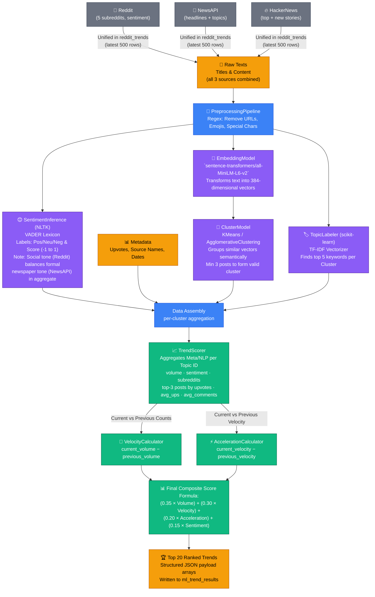

# Trend Intelligence System — ML Engine Pipeline

> The ML Engine is **source-agnostic** — it processes text regardless of whether it came from Reddit, NewsAPI, or HackerNews. All three sources feed the same `reddit_trends` table which the pipeline reads from.

## Score Formula Explanation

| Component | Weight | Source Signal |
|-----------|--------|--------------|
| **Volume** | 35% | Number of posts/articles in this cluster |
| **Velocity** | 30% | How fast this topic is growing vs last run |
| **Acceleration** | 20% | Whether growth is speeding up or slowing down |
| **Sentiment** | 15% | Average VADER compound score (−1 to +1) |

> **Sentiment note:** Reddit provides the informal social sentiment tone; NewsAPI and HackerNews contribute more neutral/formal language. The aggregate VADER score across all three sources gives a balanced sentiment picture.
